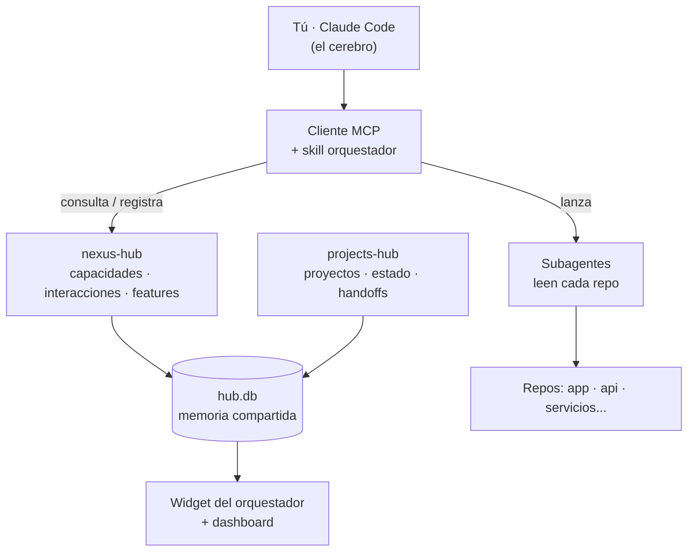

# 🧠 Nexus

> Un "cerebro" que unifica el contexto de todos tus proyectos. Hablas con **un solo lugar** y él sabe qué proyectos están involucrados, qué provee cada uno y cómo coordinarlos.

**Nexus** es un sistema de orquestación multi-proyecto construido sobre el [Model Context Protocol (MCP)](https://modelcontextprotocol.io). Está pensado para quien trabaja con **muchos repos a la vez** (frontend, backend, funciones serverless, servicios) y pierde tiempo recordando qué hace cada uno, qué expone y cómo se conectan entre sí.

La idea: en vez de tener el contexto disperso en tu cabeza y repetirlo en cada conversación con tu asistente de IA, Nexus lo guarda en una **memoria compartida persistente** y le da a tu asistente las herramientas para **rutear el trabajo solo** entre proyectos.

---

## El problema

Cuando trabajas en varios proyectos en paralelo:

- El **contexto vive fragmentado**: cada repo sabe lo suyo, pero nada conoce el mapa completo.
- Le repites a tu asistente, una y otra vez, "esto está en el repo X", "para los pagos usa el servicio Y".
- Un cambio en un proyecto **impacta a otros** y es fácil olvidarlo.
- Coordinar una misma feature en varios repos (misma rama, mismos pasos) es manual y propenso a errores.

## Qué hace Nexus

- 🗺️ **Mapa de capacidades** — registra qué **provee** y qué **consume** cada proyecto (APIs, funciones, tablas, servicios).
- 🧭 **Ruteo automático** — dado un objetivo en un proyecto, deduce qué otros proyectos están implicados y a quién consultar.
- 🔎 **Auto-servicio** — cualquier sesión **averigua sola** el contexto de otro proyecto (`get_project_context` trae su `CLAUDE.md` y capacidades), sin esperar un handoff.
- 💬 **Comunicación entre sesiones** — un buzón asíncrono (`post_message`/`read_messages`) para que sesiones de distintos proyectos se dejen preguntas y respuestas.
- 🔗 **Handoffs** — para **empujar** trabajo entregable de un proyecto a otro (decisiones, contratos, pendientes a accionar).
- 🤖 **Auto-resolución (listener)** — un daemon despierta al sistema destino con un Claude Code headless: **responde solo** las consultas simples y, para requerimientos, deja un **borrador de alcance** para tu aprobación (sin tocar código ni git). Ver [`listener/`](listener/README.md).
- 🌿 **Features coordinadas** — crea la **misma rama** (`feature/...`) en varios repos y rastrea su estado (`planned → … → merged`).
- 📊 **Visualización en vivo** — un widget del orquestador muestra el grafo de proyectos y **enciende** las interacciones en tiempo real.
- 💾 **Memoria externa** — todo persiste en una base SQLite, así el contexto de tu chat se mantiene liviano.

---

## Qué es y qué no es

**Nexus ES:**
- Una **memoria/mapa compartido** de tus proyectos (qué hay, qué provee/consume cada uno, cómo se conectan), persistente entre sesiones.
- Un modelo de **auto-servicio**: tu asistente averigua el contexto de otro sistema por sí mismo y rutea el trabajo.
- Una **capa sobre tu cliente MCP** (Claude Code): le da herramientas y memoria; el "cerebro" que piensa, da permisos y lee repos sigue siendo Claude Code.
- Una **visualización en vivo** (widget) de cómo interactúan los sistemas.

**Nexus NO es:**
- **No es un chat ni un IDE propio.** No reemplaza a Claude Code — se apoya en él. *(Hubo un experimento de chat agéntico propio; se archivó en `cockpit/experimental/` porque Claude Code cumple ese rol mejor: permisos, subagentes, lectura de repos.)*
- **No exige handoffs para enterarse de algo.** Para *averiguar* se usa el auto-servicio; los handoffs son solo para *empujar* trabajo que el otro debe accionar.
- **No es un servicio con costo propio.** Los módulos son Python + SQLite local; no llama por su cuenta a ninguna API de pago.
- **No duplica tu código ni tu estado.** Solo guarda metadatos (mapa, interacciones, mensajes); la verdad sigue en cada repo y su `CLAUDE.md`.

---

## Arquitectura



Nexus son **dos módulos MCP** que comparten una sola base de datos (`~/.claude-projects-hub/hub.db`):

| Módulo | Rol | Tablas |
|---|---|---|
| **`projects-hub`** | Base: catálogo de proyectos, estado y handoffs | `projects`, `state`, `handoffs` |
| **`nexus-hub`** | Extensión orquestadora | `capabilities`, `interactions`, `coordinated_features`, `feature_branches`, `checkpoints` |

> Diseño deliberado: una sola fuente de verdad, sin sincronización entre almacenes. `nexus-hub` **no toca** las tablas de `projects-hub`, solo las lee.

Ver el diseño completo en [docs/ARCHITECTURE.md](docs/ARCHITECTURE.md).

---

## Instalación

Requisitos: **Python 3.10+** y un cliente MCP (p. ej. [Claude Code](https://docs.claude.com/en/docs/claude-code) o Claude Desktop).

```powershell
git clone https://github.com/Yeodeol/Nexus.git
cd Nexus

# Un venv por módulo
python -m venv projects-hub\.venv
python -m venv nexus-hub\.venv
projects-hub\.venv\Scripts\python.exe -m pip install -r projects-hub\requirements.txt
nexus-hub\.venv\Scripts\python.exe  -m pip install -r nexus-hub\requirements.txt
```

Luego registra **ambos** servidores en tu cliente MCP. Ejemplo para Claude Code (`~/.claude.json` → `mcpServers`):

```json
{
  "mcpServers": {
    "projects-hub": {
      "type": "stdio",
      "command": "<ruta>/Nexus/projects-hub/.venv/Scripts/python.exe",
      "args": ["<ruta>/Nexus/projects-hub/server.py"]
    },
    "nexus-hub": {
      "type": "stdio",
      "command": "<ruta>/Nexus/nexus-hub/.venv/Scripts/python.exe",
      "args": ["<ruta>/Nexus/nexus-hub/server.py"]
    }
  }
}
```

Reinicia el cliente y ambos quedan disponibles. Las tablas se crean solas en el primer uso.

---

## Tools

### `projects-hub` (base)
| Tool | Para qué |
|---|---|
| `register_project` | Registra o actualiza un proyecto (nombre, ruta, descripción) |
| `list_projects` / `get_project` | Consulta el catálogo |
| `set_state` / `get_state` | Notas de estado por proyecto (clave-valor) |
| `send_handoff` / `get_pending_handoffs` / `consume_handoff` | Transferencia de contexto entre proyectos |

### `nexus-hub` (orquestación)
| Tool | Para qué |
|---|---|
| `delete_project` | Elimina un proyecto (seguro: no deja datos huérfanos) |
| `declare_capability` | Declara qué **provee** o **consume** un proyecto |
| `list_capabilities` / `find_providers` | Consulta el mapa de capacidades |
| `resolve_dependencies` | Dado un proyecto + intención, dice a quién consultar |
| `log_interaction` / `list_interactions` | Monitoreo de interacciones entre proyectos |
| `create_coordinated_feature` | Crea la misma rama en varios repos + entrega el comando git |
| `update_branch_state` / `get_coordinated_feature` / `list_coordinated_features` | Seguimiento de features cross-repo |
| `checkpoint` / `get_checkpoints` | Memoria externa para no saturar el contexto del chat |
| `get_project_context` | Trae el contexto de otro proyecto (descripción, capacidades y su `CLAUDE.md`) para **averiguar sin handoff** |
| `post_message` / `read_messages` | Buzón asíncrono ligero entre sesiones/proyectos (con `kind`: `note`/`question`/`answer`) |
| `ask_provider` | Pregunta a otro sistema y deja la consulta para que el **listener la auto-responda** (deduce el proveedor si no lo indicás) |
| `list_auto_runs` | Bitácora de lo que el listener auto-resolvió (estado y resultado) |

> 🧭 El skill **`/orquestar`** (en [skills/orquestar.md](skills/orquestar.md)) es el "cómo pensar" del cerebro. Cópialo a `~/.claude/commands/` (Claude Code) para orquestar trabajo que cruza repos.

### Ejemplo de uso (genérico)

```
1. declare_capability(project="pagos-svc", kind="provides",
       name="cobro_tarjeta", category="api",
       contract="POST /charge {amount, token} -> {status, id}")

2. declare_capability(project="tienda-web", kind="consumes",
       name="cobro_tarjeta", category="api")

3. resolve_dependencies(project="tienda-web")
   -> "tienda-web necesita 'cobro_tarjeta'; lo provee 'pagos-svc'"

4. create_coordinated_feature(slug="checkout-1click", type="feature",
       description="Compra en 1 clic", projects="tienda-web,pagos-svc")
   -> crea feature/checkout-1click en ambos repos + comando git
```

---

## Auto-resolución (listener)

Antes, cuando el Sistema A necesitaba algo de B, A *empujaba* un handoff… y quedaba ahí
esperando a que alguien abriera la sesión de B. El **listener** cierra ese lazo: un daemon
(`listener/nexus_listener.py`) sondea `hub.db` y, cuando aparece trabajo para un proyecto
**opt-in**, despierta a ese proyecto con un **Claude Code headless** (`claude -p`, tu
suscripción, sin API key):

- **Consulta simple** (`ask_provider` o un mensaje `kind='question'`) → el agente investiga
  **read-only** y **responde solo** al buzón del que preguntó.
- **Requerimiento** (`send_handoff`) → el agente **no toca código ni git**: deja un **borrador
  de alcance** (`checkpoint`) y avisa; el handoff queda **pendiente** para tu aprobación.

Seguridad: allowlist de tools de solo lectura (sin `Write`/`Edit`/`Bash`), permisos que
**deniegan** lo no listado, timeout, opt-in por proyecto e idempotencia (`auto_runs`). Todo
queda logueado y visible con `list_auto_runs` y en el dashboard. Guía completa en
[`listener/README.md`](listener/README.md).

```powershell
python listener/nexus_listener.py --once --dry-run --backlog   # ver qué tomaría
python listener/nexus_listener.py                              # daemon (auto-resuelve lo nuevo)
```

---

## Roadmap

- [x] **Fase 0** — Núcleo MCP (capacidades, ruteo, features coordinadas, checkpoints)
- [x] **Fase 1** — Poblado de capacidades de un proyecto piloto
- [x] **Fase 2** — Skill orquestador (el "cómo pensar" del cerebro)
- [x] **Fase 3** — Dashboard de monitoreo (grafo de interacciones + estado de ramas)
- [x] **Fase 5** — Actuadores asistidos: **listener autónomo** que auto-responde consultas y deja borradores de alcance para los requerimientos (aprobación humana). Ver [`listener/`](listener/README.md).
- [ ] **Fase 4** — Sensores externos (p. ej. monitoreo de Slack → bandeja de requerimientos)

---

## Estado

En uso activo. El núcleo (Fases 0–3) funciona, el mapa está poblado con proyectos reales, y el modelo es **auto-servicio**: el cerebro es **Claude Code** y Nexus le da el mapa, la memoria y las herramientas para averiguar y coordinar.

**Visualización en vivo** — el widget del orquestador (sin dependencias ni costo):
```powershell
python cockpit\widget_server.py     # http://localhost:8780
```
Muestra el grafo de proyectos y enciende las interacciones en tiempo real mientras trabajas en Claude Code. También está el dashboard de solo lectura (`python dashboard\dashboard.py` → `:8788`).

La API de los tools puede cambiar mientras avanza el roadmap.

## Licencia

[MIT](LICENSE) — úsalo, modifícalo y compártelo libremente.
